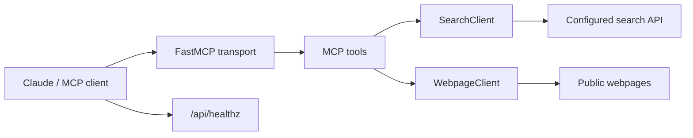

# Web Search MCP Server

A production-ready Model Context Protocol server written in Python. It gives
Claude Desktop and other MCP-compatible clients two focused capabilities:

- `web_search` — search the web through a configured Brave-compatible search API.
- `fetch_webpage` — safely fetch a public HTTP/HTTPS page and return readable text.

The server defaults to Streamable HTTP for Replit deployment and keeps stdio
available for local Claude Desktop development.

## Architecture



## Features

- Async HTTP requests with bounded timeouts.
- Structured search results with title, URL, snippet, and source domain.
- HTML extraction that removes scripts, styles, templates, SVG, canvas, and iframes.
- Manual redirect handling with URL validation at every hop.
- SSRF protection against localhost, private, loopback, link-local, multicast,
  reserved, and unspecified IP addresses.
- Response-size and extracted-text limits.
- Safe error envelopes that do not expose credentials, headers, or stack traces.
- `server://info` MCP resource describing the server and its tools.
- Health endpoint for Replit startup checks.
- Fully mocked unit tests for input validation, upstream failures, timeouts,
  redirects, extraction, and successful responses.

## Tech stack

- Python 3.12+
- MCP Python SDK 1.x / FastMCP
- `httpx`
- Pydantic Settings
- BeautifulSoup
- pytest and pytest-asyncio
- Ruff
- uv

## Project structure

```text
.
├── src/
│   └── web_search_mcp/
│       ├── config.py
│       ├── errors.py
│       ├── models.py
│       ├── server.py
│       ├── services/
│       │   ├── search_client.py
│       │   └── webpage_client.py
│       ├── tools/
│       │   ├── search.py
│       │   └── webpage.py
│       └── utils/
│           ├── extraction.py
│           └── validation.py
├── tests/
│   ├── test_search.py
│   ├── test_validation.py
│   └── test_webpage.py
├── .env.example
├── pyproject.toml
└── uv.lock
```

## Local setup

Python 3.12, uv, and Ruff are available in the Replit runtime. From a local
clone, install the project with:

```bash
uv sync
cp .env.example .env
```

Edit `.env` and set a real search provider key. The default endpoint is the
Brave Search API endpoint. The client sends the configured key as the
`X-Subscription-Token` header.

## Environment variables

| Variable | Required | Default | Description |
| --- | --- | --- | --- |
| `SEARCH_API_KEY` | For `web_search` | — | Search provider credential |
| `SEARCH_API_URL` | No | Brave web search endpoint | Brave-compatible JSON search endpoint |
| `PORT` | No | `8080` | HTTP listening port |
| `MCP_TRANSPORT` | No | `streamable-http` | `streamable-http`, `sse`, or `stdio` |
| `REQUEST_TIMEOUT_SECONDS` | No | `15` | Outbound request timeout |
| `MAX_FETCH_BYTES` | No | `2000000` | Maximum downloaded webpage bytes |
| `MAX_RESPONSE_CHARS` | No | `20000` | Maximum returned webpage text characters |

Only placeholder values belong in `.env.example`. Never commit `.env` or a
provider key.

## Run locally

### Streamable HTTP

```bash
uv run python -m web_search_mcp.server --transport streamable-http
```

The local endpoints are:

- Health: `http://127.0.0.1:8080/api/healthz`
- MCP: `http://127.0.0.1:8080/api/mcp`

### Claude Desktop over stdio

```bash
uv run python -m web_search_mcp.server --transport stdio
```

Example Claude Desktop configuration:

```json
{
  "mcpServers": {
    "web-search": {
      "command": "uv",
      "args": [
        "run",
        "--directory",
        "/absolute/path/to/web-search-mcp",
        "python",
        "-m",
        "web_search_mcp.server",
        "--transport",
        "stdio"
      ],
      "env": {
        "SEARCH_API_KEY": "replace-with-your-local-key"
      }
    }
  }
}
```

For a shared or remote deployment, use the Streamable HTTP URL instead of
putting a credential into a client configuration.

## MCP tools and resource

### `web_search`

Arguments:

```json
{
  "query": "latest Python MCP SDK documentation",
  "max_results": 5
}
```

Returns:

```json
{
  "ok": true,
  "query": "latest Python MCP SDK documentation",
  "count": 1,
  "results": [
    {
      "title": "MCP Python SDK",
      "url": "https://example.com/mcp",
      "snippet": "Build MCP servers in Python.",
      "source": "example.com"
    }
  ]
}
```

`query` is required and capped at 500 characters. `max_results` must be from 1
through 10. If `SEARCH_API_KEY` is not configured, the tool returns a clear
configuration error instead of fake results.

### `fetch_webpage`

Arguments:

```json
{
  "url": "https://example.com/docs"
}
```

Returns the page URL, title, extracted text, character count, truncation state,
and content type. Only public HTTP/HTTPS HTML pages are supported.

### `server://info`

The resource returns the server name, version, available tools, and a short
project description.

## Deploy on Replit

The project is already configured with one API service. The service:

- binds to `0.0.0.0`;
- reads the assigned `PORT`;
- serves `GET /api/healthz`;
- serves MCP at `/api/mcp`;
- starts with `pnpm --filter @workspace/api-server run dev`.

Add the following Replit Secret:

```text
SEARCH_API_KEY
```

Optional environment variables can be configured as regular environment
variables or secrets when appropriate:

```text
SEARCH_API_URL
REQUEST_TIMEOUT_SECONDS
MAX_FETCH_BYTES
MAX_RESPONSE_CHARS
MCP_TRANSPORT=streamable-http
```

The Replit deployment command is managed by the existing artifact service:

```bash
pnpm --filter @workspace/api-server run build
```

Its production process is equivalent to:

```bash
PYTHONPATH=src uv run python -m web_search_mcp.server --transport streamable-http
```

After publishing, connect an MCP client to:

```text
https://<your-replit-domain>/api/mcp
```

Use `/api/healthz` to verify the service is live.

## Testing and linting

```bash
uv run pytest
uv run ruff check .
```

Tests do not call a real search provider or public website; all network
requests are mocked.

## Security considerations

- API keys are read only from environment variables.
- Provider credentials are sent only to the configured search endpoint.
- Credentials and sensitive headers are not included in errors.
- Webpage URLs are restricted to HTTP/HTTPS and validated before every request.
- DNS results are checked to prevent requests to private or local networks.
- Redirects are bounded and revalidated.
- Downloaded bytes and returned text are capped.
- `.env`, virtual environments, caches, and bytecode are ignored by Git.

## Future improvements

- Add provider adapters for additional search APIs with provider-specific
  authentication headers.
- Add optional result caching with a bounded TTL.
- Add authentication for public remote MCP deployments.
- Add observability metrics for latency, provider errors, and truncation rates.

## GitHub

```bash
git init
git add .
git commit -m "Build web search MCP server"
git branch -M main
git remote add origin https://github.com/<your-user>/<your-repository>.git
git push -u origin main
```

Review `.env` and all deployment secrets before the first commit.

[](https://m8ven.ai/mcp/harshit-seth/mcp_server_ultron)
